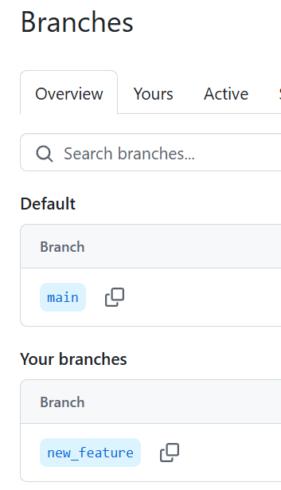

## Conflicto rama repositorio remoto. 

Supongamos que tenemos un repositorio y un colaborador. Un  colaborador tiene otra rama, **y quiere unir cambios con los que tenemos en la rama main**, a esta rama ya le hemos realizado cambios... Por lo que se profuce un conflicto para unir con la rama **``main``**. 

### **Ejemplo**


1. **Creamos una nueva rama**

```bash
git branch new_feature # Creamos

git switch new_feature #Cambiamos a ella

git branch # Consultamos por las ramas disponibles. 

PS C:\Users\(...)\Cursos 2-7> git branch 
  main
* new_feature
```

2. Podemos crear un archivo para generar un conflicto 

Así está en la rama creada **``"new_feature"``**`

```python
def main():
        """El método main encapsula el procedimiento de lógica del proyecto y lo lanza"""
        print("Todo está Ok!")

main()

def suma_elementos(elemento1: int, elemento2: int):
        """Suma dos elementos 

        Args:
            elemento1 (int): primer elemento a sumar 
            elemento2 (int): segundo elemento a sumar
        """
        return elemento1 + elemento2
```

Confirmamos cambios con **``git add``** y **``git commit``** en la rama adicional y procedemos a subir esta nueva rama al repositorio remoto. 


```bash

PS C:\Users\(...)\Cursos 2-7> git branch 
  main
* new_feature

PS C:\Users\(...)\Cursos 2-7> git add . 

PS C:\Users\(...)\Cursos 2-7> git commit -m "Archivo free_memory modificado en la nueva rama a subir 'new_feature'"
[new_feature 23b0918] Archivo free_memory modificado en la nueva rama a subir 'new_feature'
 3 files changed, 100 insertions(+), 1 deletion(-)
 create mode 100644 Curso 3 Git/Ramas/conflicto_rama_repo_remoto.md

PS C:\Users\(...)\Cursos 2-7> git push -u origin new_feature
Enumerating objects: 19, done.
Counting objects: 100% (19/19), done.
Delta compression using up to 12 threads
Compressing objects: 100% (13/13), done.
Writing objects: 100% (13/13), 2.81 KiB | 479.00 KiB/s, done.
Total 13 (delta 6), reused 0 (delta 0), pack-reused 0
remote: Resolving deltas: 100% (6/6), completed with 3 local objects.
remote: 
remote: Create a pull request for 'new_feature' on GitHub by visiting:
remote:      https://github.com/danieljaramillo52/C_GOOGLE_CURSO2/pull/new/new_feature
remote:
To https://github.com/danieljaramillo52/C_GOOGLE_CURSO2.git
 * [new branch]      new_feature -> new_feature
branch 'new_feature' set up to track 'origin/new_feature'.
PS C:\Users\(...)\Cursos 2-7>
```

Podememos ver en fecto la rama agregada al repo remoto. 



Ahora nuestro colaborador, realizo cambios en la rama **``main``** a la función que teniamos en uno de nuestros modulos. 


```python
def main():
        """El método main encapsula el procedimiento de lógica del proyecto y lo lanza"""
        print("Todo está Ok!")

main()

def suma_elementos(num1: int, num2: int):
        """Suma dos elementos 

        Args:
            num1 (int): primer elemento a sumar 
            num2 (int): segundo número  a sumar
        """
        return elemento1 + elemento2

```

Luego de consginar cambios, podemos ver que no estamos del todo sincronizadso entre ramas. 

git switch main
Switched to branch 'main'
Your branch and 'origin/main' have diverged,
and have 1 and 1 different commits each, respectively.
  (use "git pull" to merge the remote branch into yours)

las ramas divergen porque el cambio realizado en el main "**main**" por el colaborador no está en mi rama **main** y yo tengo un cambio en la rama remota. 

Vamos a intentar traer los cambios del repo remoto primero: 


