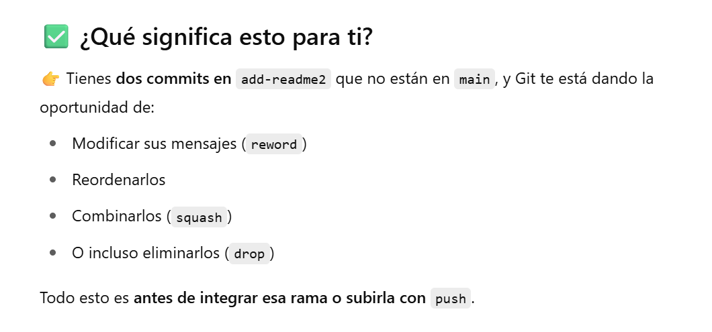

## **git rebase -i**

Es una herramiewnta que permite modificar el historial de commits en un repositorio, sirve para combinar commits , eliminar o reemplazar alguno. Lo recomentdado es hacerlo sobre el repositorio local , no el remoto colaborativo. 


Cuando funcionará esto ? 
Cuando tenemos commits en otra rama... Que queremos aplanar sobre el main (Similar a lo que hacemos cuando utilizamos merge de ramas. )

Para esto el main y una rama deben estar desactualizados entre si, La rama sorepasa al main. 

Desde una rama por ejemplo: 

```bash
Lab_1_pilas_colas (main)
$ git switch add-readme2
Switched to branch 'add-readme2'
Your branch is up to date with 'origin/add-readme2'.
```
Podemos cambiar a la rama ``add-reame2`` Podemos ver que está actualizada contra si misma, pero veamos contra el main. 

```bash
git rebase -i main
```

1. Reescribir mensajes de commits. 

Entramos al modo interactivo

```bash 
git rebase -i main
```

游 쯈u칠 hiciste?
Estando en la rama **add-readme2**, ejecutaste:

```bash
git rebase -i main
```
Eso significa:

Reescribe los commits que están en add-readme2 pero no en main, de forma interactiva.




Todos estos procesos son símilares a un merge pero no de forma agresiva... 


#### **OJO ESTO SOLO FUNCIONA SI LA RAMA QUE QUEREMOS APLASTAR SOBRE MAIN YA ESTA LIMPIA SIN CAMBIOS POR AÑADIR O SIN COMMIT, ES DEICR, PERMANECEN EN STAGE.**

``(Verificación previa. Rama correcta y stage vacio)``

```bash
AzureAD.../Lab_1_pilas_colas (add-readme2)
$ git branch 
  add-readme
* add-readme2
  main

AzureAD.../Lab_1_pilas_colas (add-readme2)
$ git status
On branch add-readme2
Your branch is ahead of 'origin/add-readme2' by 5 commits.
  (use "git push" to publish your local commits)

nothing to commit, working tree clean
```

Ahora si estamos seguros: 

```bash
git rebase -i main
```

2. Cambiamos la configuración de **pick** por **reword**

Permite reescribir un commit que tengamos, cambiar su contenido. 

Luego de entrar en el modo interactivo presionamos "i" para entrar en el modo de inserción y así podemos modifcar el comportamineto pick por reword. 


Posteriormente cerramos el editor guardando el cambio. 

De inmediato se abre otro editor para modificar el mensaje del commit 


```**OJO AL GUARDAR EL CAMBIO ES COMMUN EN WINDOWS / ONE DRIVE / VS CODE que aprezca este mensaje.**``` 


```bash
[detached HEAD 806bf1c] Add readme to the proyect in the branch add-readme
Date: Thu Jul 31 17:48:41 2025 -0500
 1 file changed, 1 insertion(+)
 create mode 100644 Readme.MD
Successfully rebased and updated refs/heads/add-readme2.
Deletion of directory '.git/rebase-merge' failed. Should I try again? (y/n)
```

La primera parte:
```bash 
[detached HEAD 806bf1c] Add readme to the proyect in the branch add-readme
Date: Thu Jul 31 17:48:41 2025 -0500
 1 file changed, 1 insertion(+)
 create mode 100644 Readme.MD
Successfully rebased and updated refs/heads/add-readme2.
``` 

Indica que el cambio es correcto y se aplicó. 


La segunda parte. 

```bash
Deletion of directory '.git/rebase-merge' failed. Should I try again? (y/n)
``` 

Es un mensaje Típico de windows que quiere borrar carpetas temporales, pero que no le es permitido. Ya sea por **ONE DRIVE / VS CODE** que son temas de sincronización etc.

Para salir del estado del rebase podemos utilizar

1. **En CMD**

``rd /s /q .git\rebase-merge``

2. **En powershell**

``Remove-Item -Force -Recurse .git\rebase-merge``

## Otros comandos con git rebase -i-

Para aplastar los cambios sobre la rama main. 

## Aplastar todo el historial de commits completo. 

1. **``git rebase main``**

2. **``git merge main``**


