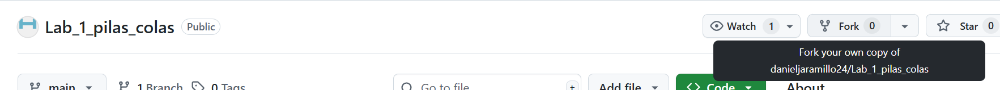
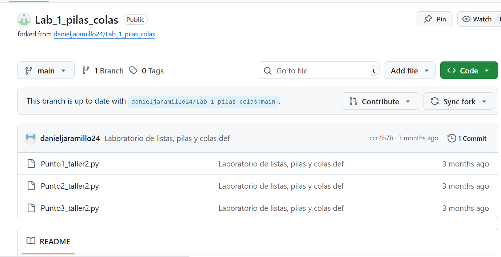
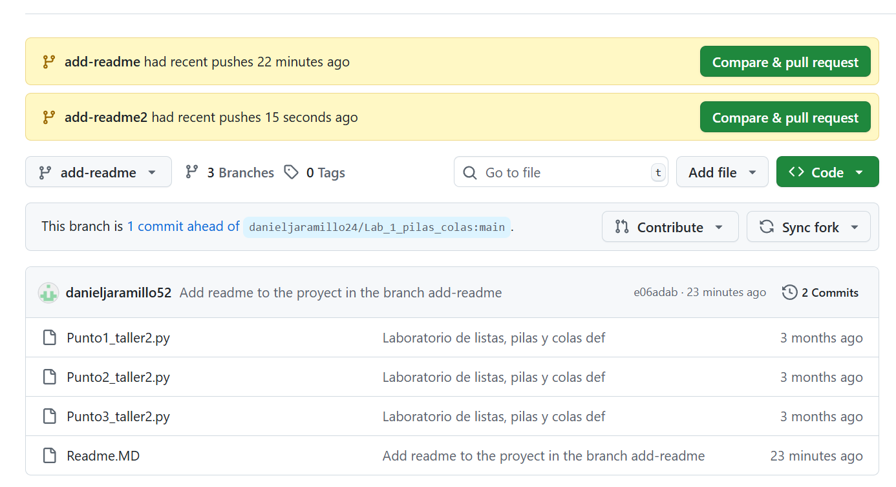
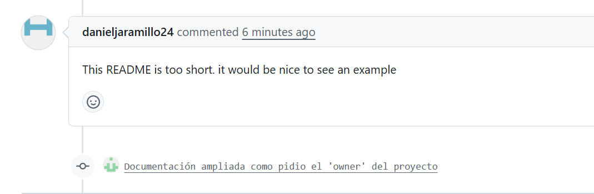

## **Fork de repositorio rémoto**

Un repositorio publico en git hub es clonable / Local y Remotamente. 

Para clonarlo localmente solo debemos ir a Code y aplicar ``git clone``

Para tener una copia exacta en el remoto ( Que podriamos clonar al local ) Hacemos un **Fork**

Aquí tenemos un repositorio publico que permite hacer un **Fork**


Así al crearlo tenemos una copia exacta en nuestro propio remoto. 




### **Clonamos el repositorio**
```bash

# Clonamos el proyecto

git clone https://github.com/danieljaramillo52/Lab_1_pilas_colas.git

# Creamos una rama adicional

git branch "add-readme"

# Cambiamos de rama 
git switch "add-reame"

# Creamos un README.md agregamos contenido y lo commiteamos 
git add README.md 

git commit -m "..." 

# Lo impulsamos a la misma rama en el repo remoto
git push -u origin "add-readme"

```
###  **Cree dos ramas y empuje cambios**


-> Hemos empujado dos cambios al repositorio remoto en diferentes ramas. 

GIT HUB : NOS PERMITE VER LOS DOS PULL REQUEST QUE TENENEMOS PARA EMPUJAR. 

Podemos elegir la opción **contibuir** y abrir un pull requets. 

Podemos ver el cambio. Ya mandamos la solicitud del pull requets para hacerlo. 

El, dueño del proyecto puede contestar con un comentario el pull requetst , nos pide, por ejejmplo mejorar la documnetación y así el pueda aceptar el cambio para mejorar el proyecto. 


Hemos realizado ya un nuevo comentario / modificado la documentación y lo empujamos en la rama add-readme. Automaticamente podemos ver el nuevo cambio en el flujo del "pull-requets"

