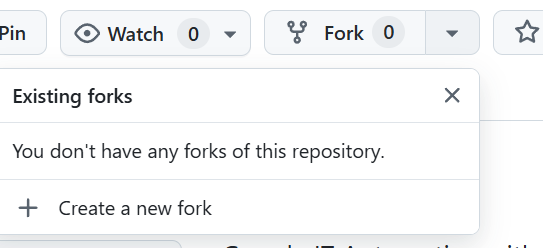

# Laboratorio unidad 4 

Link repo para fork:  https://github.com/google/it-cert-automation-practice

Creamos un fork sobre el proyecto suministrado por el lab. 



clonar el repositorio: 

```bash
git clone https://github.com/danieljaramillo52/it-cert-automation-practice.git
```

Cambiamos de directorio al de practica y revisamos el enlace con el repositorio remoto. 

1. student@f2b7a1e61b8e:~$ cd ~/it-cert-automation-practice

2. student@f2b7a1e61b8e:~/it-cert-automation-practice$ git remote -v

origin  https://github.com/danieljaramillo52/it-cert-automation-practice.git (fetch)
origin  https://github.com/danieljaramillo52/it-cert-automation-practice.git (push)


# Guía: Uso de `git remote add upstream` y sincronización de forks

## ¿Qué hace este comando?
```bash
git remote add upstream https://github.com/[git-username]/it-cert-automation-practice.git
```

Agrega un nuevo remoto llamado upstream a tu repositorio local.

Este remoto normalmente apunta al repositorio original (no a tu fork).

Así puedes mantener tu fork actualizado con los cambios del proyecto base. 


Podemos verificar ahora los remotos con: 
```bash
git remote -v
```

Podemos ver que ahora tenemos los "originales" enlazados a mi fork y los "upstream" enlazados al proyecto original.

---

### Regirstramos credneciales / creamos una nueva rama / ingresamos a un directorio del curso y revisamos la presencia de un archivo "validations.py"

student@f2b7a1e61b8e:~/it-cert-automation-practice$ git config --global user.name "Daniel"

student@f2b7a1e61b8e:~/it-cert-automation-practice$ git config --global user.email "daniel.jaramillo@xpertgroup.co"

student@f2b7a1e61b8e:~/it-cert-automation-practice$ git branch 
* master

student@f2b7a1e61b8e:~/it-cert-automation-practice$ git branch improve-username-behavior   

student@f2b7a1e61b8e:~/it-cert-automation-practice$ git branch improve-username-behavior
* master

student@f2b7a1e61b8e:~/it-cert-automation-practice$ git switch improve-username-behavior 
Switched to branch 'improve-username-behavior'

student@f2b7a1e61b8e:~/it-cert-automation-practice$ ls
Course3  Course4  Course5  LICENSE  README.md  docs

student@f2b7a1e61b8e:~/it-cert-automation-practice$ cd "Course3/Lab4"


student@f2b7a1e61b8e:~/it-cert-automation-practice/Course3/Lab4$ ls
validations.py

```python
import re
def validate_user(username, minlen):
    """Checks if the received username matches the required conditions."""
    if type(username) != str:
        raise TypeError("username must be a string")
    if minlen < 1:
        raise ValueError("minlen must be at least 1")
    
    # Usernames can't be shorter than minlen
    if len(username) < minlen:
        return False
    # Usernames can only use letters, numbers, dots and underscores
    if not re.match('^[a-z0-9._]*$', username):
        return False
    if 
    # Usernames can't begin with a number
    if username[0].isnumeric():
        return False
    return True
```


Abrimos el editor le agregamos: 
```bash
nano validations.py
```

```python
print(validate_user("blue.kale", 3)) # True
print(validate_user(".blue.kale", 3)) # Currently True, should be False
print(validate_user("red_quinoa", 4)) # True
print(validate_user("_red_quinoa", 4)) # Currently True, should be False
```

