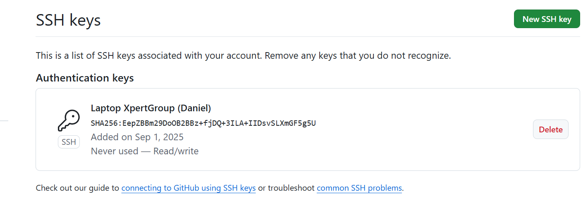

# Claves ssh

Podemos generar claves ssh para autenticación en git hub siguiendo el procedimiento: 

## Generar una nueva clave ssh 

```bash

# Utilizamos el correo de una cuenta de github en cuestión.  (Vamos a tener una clave para el repositorio local configurado luego podremos copiar una publica para el github)

ssh-keygen -t ed25519 -C "daniel.jaramillo@xpertgroup" 

PS C:\Users\DanielJaramilloBusta\OneDrive - XPERTGROUP S.A.S\Xpert Group Cursos\Certificación Google_automatización_python\Cursos 2-7> ssh-keygen -t ed25519 -C "daniel.jaramillo@xpertgroup.com"

>> 
Generating public/private ed25519 key pair.
Enter file in which to save the key (C:\Users\DanielJaramilloBusta/.ssh/id_ed25519): 
Created directory 'C:\\Users\\DanielJaramilloBusta/.ssh'.

Enter passphrase (empty for no passphrase): 

Enter same passphrase again: 

Your identification has been saved in C:\Users\DanielJaramilloBusta/.ssh/id_ed25519
Your public key has been saved in C:\Users\DanielJaramilloBusta/.ssh/id_ed25519.pub

The key fingerprint is:
SHA256:EepZBBm29DoOB2BBz+fjDQ+3ILA+IIDsvSLXmGF5g5U daniel.jaramillo@xpertgroup.com
The key's randomart image is:
+--[ED25519 256]--+
| .=.  =+o        |
|o. + +.= .       |
|o.. E + +        |
|o .* = + .       |
|o.*.= % S        |
|.+ *.B X .       |
|..*.. o +        |
|....             |
|                 |
+----[SHA256]-----+
PS C:\Users\DanielJaramilloBusta\OneDrive - XPERTGROUP S.A.S\Xpert Group Cursos\Certificación Google_automatización_python\Cursos 2-7>
```

En resumen: 

Se generó un par de claves:

Privada: **C:\Users\DanielJaramilloBusta\.ssh\id_ed25519 ← nunca la compartas.**

Pública: **C:\Users\DanielJaramilloBusta\.ssh\id_ed25519.pub ← esta sí se comparte (GitHub/servidores).**

## Como usar la clave ssh generada

 ### 1. Primero vamos a iniciar el agente ssh.

```bash
eval $(ssh-agent -s)


AzureAD+DanielJaramilloBusta@XG39 MINGW64 ~/OneDrive - XPERTGROUP S.A.S/Xpert Group Cursos/Certificación Google_automatización_python/Cursos 2-7 (main)
$ eval $(ssh-agent -s)
Agent pid 118
```


Significa que iniciaste el ssh-agent (el proceso que guarda tus claves en memoria) y te está diciendo el PID (process ID) del agente: 118. Todo bien: el agente está corriendo en esa sesión.

### 2. Agregar la clave privada generada al agente.

```bash
ssh-add ~/.ssh/id_ed25519
```

Resultado: 

$ ssh-add ~/.ssh/id_ed25519
Identity added: /c/Users/DanielJaramilloBusta/.ssh/id_ed25519 (daniel.jaramillo@xpertgroup.com)

### 3. Copiar la clave publica (termina en .pub)

```bash 
cat ~/.ssh/id_ed25519.pub
```

Esto me retorna la clave publica: 

ssh-ed25519 AAAAC3NzaC1lZDI1NTE5AAAAIPixJDl8AfZH03eOgPyxu5bnFs+Dvh4qUMVii+AQzgsx daniel.jaramillo@xpertgroup.com

### 4. Registrar la clave publica en GitHub


```Buscar : Github / Settings / SSH and GPG keys / New SSH keys```

le damos un nombre a la nueva key : Ejmplo: **Laptop XpertGroup (Daniel)**

Key type :  **Autentication-key**

Pegamos la clave publica que generamos con:

```bash 
cat ~/.ssh/id_ed25519.pub
```

Y añadimos la llave ssh. 

Luego podremos verla. 



### 5. **Probar conexión**

ssh -T git@github.com

NOTA: Al ser la primera vez podemos ver un mensaje:

```bash
AzureAD+DanielJaramilloBusta@XG39 MINGW64 ~/OneDrive - XPERTGROUP S.A.S/Xpert Group Cursos/Certificación Google_automatización_python/Cursos 2-7 (main)
$ ssh -T git@github.com
The authenticity of host 'github.com (140.82.113.4)' can't be established.
ED25519 key fingerprint is SHA256:+DiY3wvvV6TuJJhbpZisF/zLDA0zPMSvHdkr4UvCOqU.
This key is not known by any other names
Are you sure you want to continue connecting (yes/no/[fingerprint])?
```

 la huella **``ED25519``** de github.com coincide con la publicada oficialmente por GitHub

En este punto escrbimos **yes**

Ahora podemos ver el mensaje

**``Hi danieljaramillo52! You've successfully authenticated, but GitHub does not provide shell access.``**


## Diferencias con un **token de https**:

### HTTPS

No debe volver a generarse desde github. El token queda guarado si se borra pedirá uno nuevo cada vez.  Tambien se puede vencer

Se debe renovar para difentes máqinas. Generar uno nuevo para volverlo a utilizar. 

### SSH

**Autenticación:** La clave privada se empareja con la publica de github 

**Caducidad:** No caducan automaticamente.

**Renovación:** Solo si la revocas en git hub o la borras de la maquina 

**Uso en multiples máquinas**: Se genera un par de claves distintas para cada equipo y se registra en tu cuenta. 

Son utiles para la automatización porque no requieren de renovar tokens constantemente.